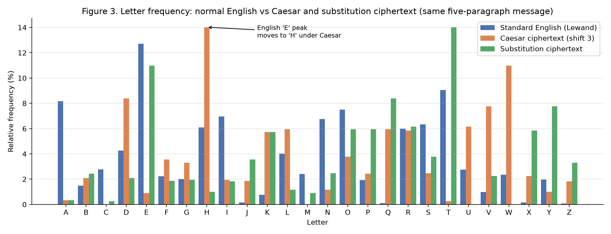

# Building and Breaking Classical Ciphers: Caesar vs Substitution

**AI for Cybersecurity — Module 2 Lab (2.9)**  
Ruthvik Nath Bandari  
Colab notebook: `Ruthvik_Nath_Bandari_Encryption_Lab2.ipynb` (figure numbers match the notebook)

## Introduction

This lab implements two classical ciphers, the Caesar shift and the simple substitution cipher, and then attacks both. The aim was to measure *why* one is stronger, and why neither is secure.

## Methodology

**Data and preprocessing.** The attacks compare ciphertext against a model of English, so two inputs were loaded and validated first. The first is Lewand's letter-frequency table; the code checks that it covers all 26 letters and sums to 100%. The second is an original five-paragraph corpus (2,302 letters). Analysis normalised text to uppercase A–Z; the ciphers themselves preserve case, spaces, digits and punctuation, and reject invalid input (`None`, non-strings, non-permutation keys).

**Ciphers.** Caesar shifts each letter by *k* (mod 26). Substitution maps A–Z through a randomly shuffled alphabet generated from a fixed seed, and decryption uses the inverse mapping. Assertions verify every test case, including `Hello World` → `Khoor Zruog`.

**Attack logic.** Each candidate decryption is scored with Pearson's chi-squared statistic against English letter frequencies, and the lowest score wins. I chose chi-squared over the common "most frequent letter is E" heuristic because it uses all 26 letters and heavily penalises rare letters (Q, X, Z) appearing too often, which is exactly what a wrong shift produces. For substitution, the attack combined rank-matching of frequencies, common-word patterns (*THE*, *AND*) and a known-word "crib" matched by letter pattern.

## Results

Both ciphers encrypted and decrypted all test cases correctly. Timing scaled linearly with length. Substitution was actually about a third faster on long inputs (0.07 vs 0.11 µs per character), so speed does not separate the two.

The automated Caesar breaker recovered a hidden shift from a single sentence. The correct candidate scored χ² = 14.9, against 249.5 for the runner-up. Across 300 random trials per length (Figure 2), chi-squared recovered the key 93% of the time at 20 letters and 100% from 50 letters. The naive E-rule managed only 34% and 67% at those lengths.

On substitution, frequency ranking alone decrypted 42.6% of the ciphertext letters correctly. Assuming the two commonest three-letter words were *THE* and *AND* raised this to 51.7%. One guessed word, "encryption", matched exactly one cipher word by shape and raised it to 89.4%, leaving readable text.

## Security Analysis

| Criterion | Caesar | Substitution |
|---|---|---|
| Key space | 25 (≈4.6 bits) | 26! ≈ 4×10²⁶ (≈88 bits) |
| Brute force at 10⁹ keys/s | nanoseconds | ≈1.3×10¹⁰ years |
| Known plaintext | one letter reveals the key | one word reveals its letters (36% here) |
| Repeated words / patterns | leaked | leaked |
| Frequency analysis | broken instantly | broken with a paragraph |

Substitution's 84-bit key-space advantage is irrelevant because the attacker never searches keys. Figure 3 shows the reason. Caesar slides the English histogram sideways, and substitution shuffles it, but when sorted (notebook Figure 4), both ciphertext distributions are identical to the plaintext's. Repeated words also encrypt identically, and letter patterns such as the double *s* in *password* survive, so a single guessed word can be located by its shape alone.

## Conclusion

Caesar falls to brute force in a fraction of a second. Substitution survives brute force but still falls to statistics, because both ciphers are deterministic and monoalphabetic: they relabel letters without hiding their frequencies or structure. The key lesson is that a large key space is necessary but not sufficient. Secure ciphers such as AES-GCM also need diffusion and randomisation, so that ciphertext is statistically indistinguishable from noise.

The breaker is itself a small statistical classifier that scores inputs against a model of "normal," the same principle behind the Module 1 intrusion detector. Results come from one English corpus; a hill-climbing substitution solver is the natural extension.

## References

Lewand, R. E. (2000). *Cryptological mathematics*. Mathematical Association of America.  
Singh, S. (1999). *The code book*. Doubleday.  
Stallings, W. (2017). *Cryptography and network security* (7th ed.). Pearson.
