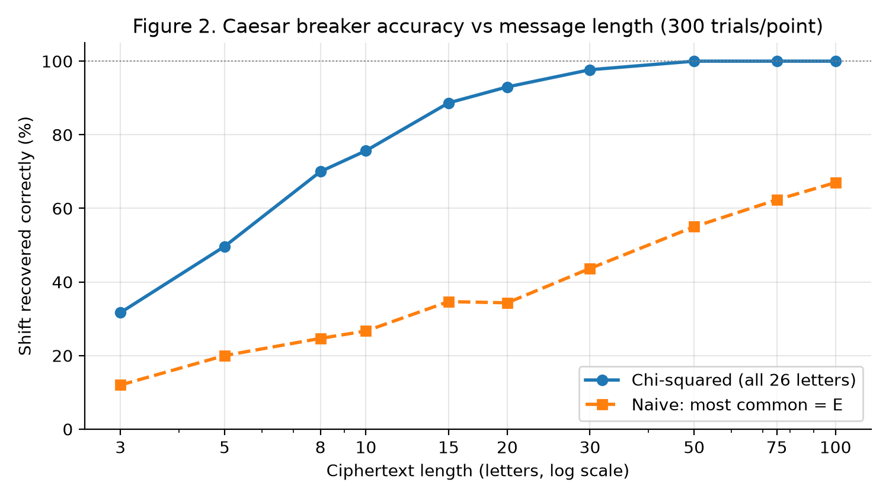
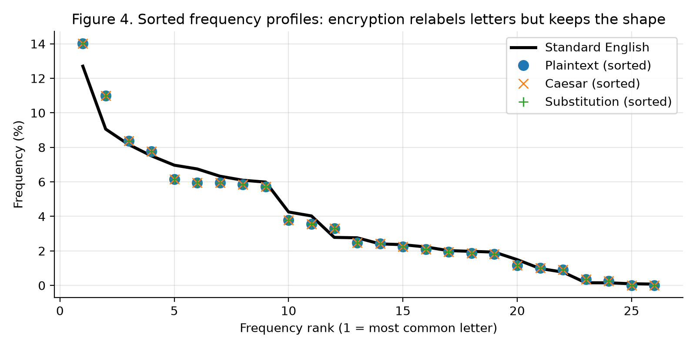

# Module 2: Building and Breaking Classical Ciphers

Implements the **Caesar** and **simple substitution** ciphers from scratch, then breaks both with statistical cryptanalysis. That covers an automated chi-squared brute-force breaker, frequency analysis, word-pattern matching and a known-plaintext attack.

**Report (PDF):** [`Ruthvik_Nath_Bandari_Module2_Lab_Report.pdf`](Ruthvik_Nath_Bandari_Module2_Lab_Report.pdf)
**Notebook:** [`Ruthvik_Nath_Bandari_Encryption_Lab2.ipynb`](Ruthvik_Nath_Bandari_Encryption_Lab2.ipynb)

## Key results

| Finding | Result |
|---|---|
| Caesar breaker (chi-squared) accuracy | **93%** at 20 letters, **100%** from 50 letters (300 trials per length) |
| Naive "most common letter = E" baseline | 34% at 20 letters, 67% at 100 letters |
| Substitution: frequency ranking only | 42.6% of ciphertext letters recovered |
| + common words *THE* / *AND* | 51.7% |
| + one known word ("encryption") | **89.4%**, readable plaintext with no brute force |
| Key space | Caesar 25 (~4.6 bits) vs substitution 26! ≈ 4×10²⁶ (~88 bits) |

**Takeaway:** substitution has a far larger key space but still falls quickly. Both ciphers are deterministic and monoalphabetic, so letter frequencies, repeated words and word shapes survive encryption unchanged.

<p align="center">
  
  
</p>

## What's inside

| Section | Content |
|---|---|
| 1. Preprocessing | English frequency reference (Lewand), an original 5-paragraph corpus, input validation |
| Task 1.1 / 1.2 | Caesar and substitution `encrypt` / `decrypt`, with `assert`-based tests and edge cases |
| Task 1.3 | Side-by-side ciphertexts and a timing benchmark (10 → 100,000 chars) |
| Task 2.1 | Letter-frequency counter, chi-squared scoring, a 25-shift brute force, and the substitution attack |
| Task 2.2 | Security analysis: brute force, pattern leaks, known plaintext, frequency |
| Task 2.3 | Six figures and a security comparison table |

## Run it

**Google Colab:** upload the notebook and choose *Runtime → Run all*. It needs no data files or extra setup.

**Locally:**
```bash
python -m venv .venv && source .venv/bin/activate
pip install -r ../requirements.txt
jupyter lab Ruthvik_Nath_Bandari_Encryption_Lab2.ipynb
```

All randomness is seeded (`SEED = 42`), so keys, tables and figures reproduce exactly. Figures are written to [`figures/`](figures/).

## Stack
Python 3 · `collections` · `string` · `random` · `time` · `math` · matplotlib · pandas
