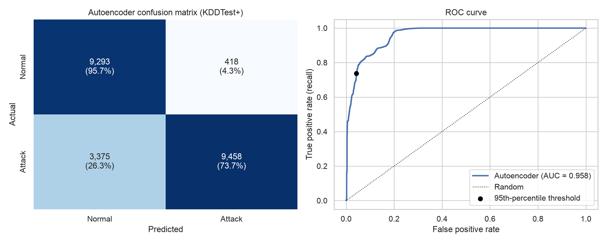
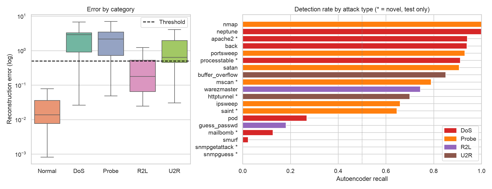

# Module 3: Autoencoder Network Intrusion Detection (NSL-KDD)

An **unsupervised anomaly detector**: a dense autoencoder trained only on *normal* NSL-KDD connections flags any connection it cannot reconstruct. It is compared with an Isolation Forest and broken down by attack type, including 17 attack types that appear only in the test set.

**Notebook:** [`Bandari_Ruthvik_AI_IDS_lab3.ipynb`](Bandari_Ruthvik_AI_IDS_lab3.ipynb)
**Report (PDF, APA 7):** [`Bandari_Ruthvik_AI_IDS_lab3_Report.pdf`](Bandari_Ruthvik_AI_IDS_lab3_Report.pdf)

## Key results (KDDTest+, 22,544 connections)

| Metric | Autoencoder | Isolation Forest |
|---|---|---|
| Precision / Recall / F1 | 0.958 / **0.737** / **0.833** | 0.972 / 0.660 / 0.786 |
| False-positive rate | 0.043 | **0.025** |
| ROC-AUC | **0.958** | 0.939 |
| Recall: DoS / Probe / R2L / U2R | **0.86** / 0.81 / **0.35** / **0.69** | 0.80 / **0.91** / 0.07 / 0.50 |
| Recall on novel (test-only) attack types | 0.665 | 0.690 |

**Takeaways:** floods and scans are caught at over 90%. R2L is hardest: `snmpgetattack` records are often numerically identical to normal traffic, and `guess_passwd` only shows up across many sessions. Dropping the categorical features (as the brief requires) costs `smurf` detection, because its packet sizes are anomalous only for ICMP. Applying `log1p` before StandardScaler raised ROC-AUC from 0.936 to 0.958.

<p align="center">
  
  
</p>

## Pipeline

1. **Data:** 41 features → drop 3 categorical + 1 constant → 37 numerical; normal-only training data split 80/20; `log1p` on heavy-tailed features; StandardScaler fitted on the training split only.
2. **Model:** `37 → Dense(20, relu) → Dense(10, relu) → Dense(20, relu) → 37 (linear)`, Adam + MSE, 50 epochs, early stopping (patience 5).
3. **Threshold:** 95th percentile of training reconstruction error (5.05% false positives on held-out normal validation data).
4. **Evaluation:** classification report, confusion matrix, ROC, threshold sensitivity, Isolation Forest baseline with matched-FPR comparison, per-category and per-attack recall, feature-level errors, and a preprocessing ablation.

## Run it

**Google Colab:** upload the notebook and choose *Runtime → Run all*. It downloads NSL-KDD automatically (about 20 MB).

**Locally** (TensorFlow needs Python ≤ 3.12 or 3.13):
```bash
pip install tensorflow scikit-learn pandas matplotlib seaborn
jupyter lab Bandari_Ruthvik_AI_IDS_lab3.ipynb
```
Seeds are fixed (`SEED = 42`) and op determinism is enabled. Other TensorFlow versions may shift the numbers slightly.

**Rebuild the report PDF** (needs Google Chrome): `python report/build_apa_report.py`

Dataset: NSL-KDD, Canadian Institute for Cybersecurity, <https://www.unb.ca/cic/datasets/nsl.html>. It is not committed to the repository.
